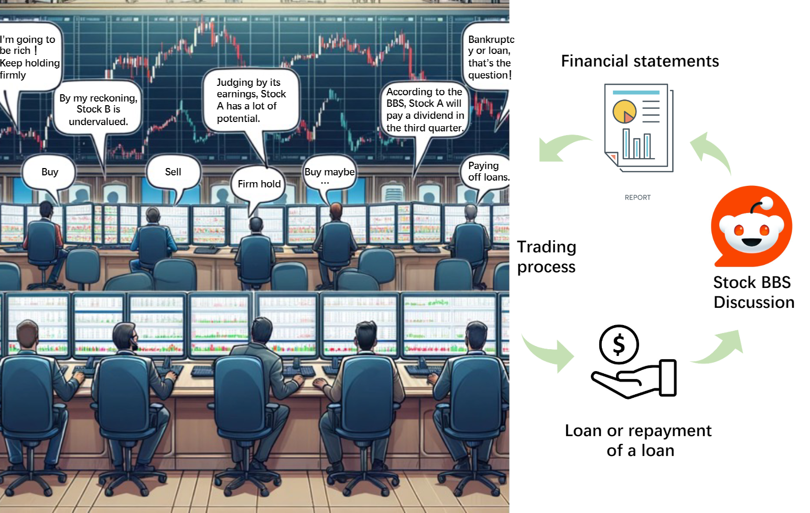
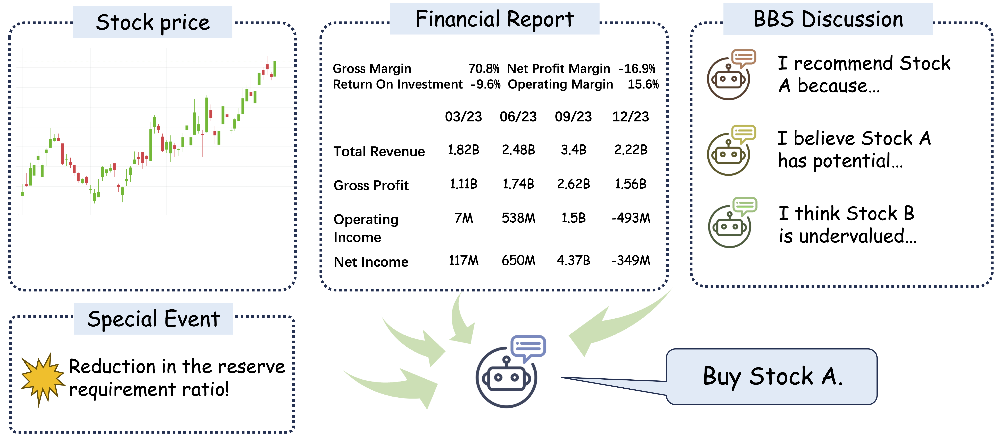

# StockBro

StockBro is an LLM-powered trading simulation lab. It models a small market where autonomous
trader agents borrow cash, place limit orders, react to company reports and policy events, and
leave public forum messages that influence the next trading day.

The project is designed for experiments, not live trading. It gives you a controllable sandbox for
studying how different model choices, prompts, market rules, and external events change simulated
investor behavior.




## Features

- Multi-agent trader simulation with configurable agent count, trading days, and sessions per day.
- OpenAI, Gemini, and deterministic `mock` model adapters.
- Limit-order books for two simulated stocks.
- Basic matching engine with partial fills and crossed-limit execution.
- Loan decisions, interest payments, repayment dates, and bankruptcy handling.
- Synthetic financial reports and policy-rate events.
- Forum-style daily messages that become next-day context.
- Structured output records for trades, prices, agent sessions, and daily agent summaries.
- Lightweight core tests for JSON validation and market matching behavior.

## Project Layout

```text
main.py                 # simulation entrypoint and day/session loop
agent.py                # trader state and LLM decision methods
config.py               # simulation parameters, reports, special events
llm_client.py           # OpenAI/Gemini/mock model adapter
market.py               # order book and matching engine
secretary.py            # JSON extraction and validation
stock.py                # stock state and price updates
record.py               # in-memory records flushed to files
prompt/agent_prompt.py  # prompt rendering functions
log/custom_logger.py    # console + file logger
tests/test_core.py      # core unit tests
```

## Setup

```bash
conda create --name stockbro python=3.9
conda activate stockbro
pip install -r requirements.txt
```

For OpenAI models:

```bash
export OPENAI_API_KEY=YOUR_OPENAI_API_KEY
```

For Gemini models:

```bash
export GOOGLE_API_KEY=YOUR_GOOGLE_API_KEY
```

## Quick Start

Run a no-cost smoke test with the deterministic mock model:

```bash
python3 main.py --model mock --agents 2 --days 1 --sessions 1 --output-dir res_mock
```

Run a small real-model simulation:

```bash
python3 main.py --model gpt-4o-mini --agents 5 --days 3 --sessions 2 --output-dir res
```

Run with Gemini:

```bash
python3 main.py --model gemini-pro --agents 5 --days 3 --sessions 2 --output-dir res
```

## Runtime Options

```bash
python3 main.py \
  --model mock \
  --agents 10 \
  --days 5 \
  --sessions 2 \
  --seed 42 \
  --output-dir res \
  --log-level INFO
```

Common flags:

- `--model`: `mock`, an OpenAI model name, or a Gemini model name.
- `--agents`: number of trader agents.
- `--days`: number of simulated trading days.
- `--sessions`: number of trading sessions per day.
- `--seed`: random seed for reproducible initialization and trading order.
- `--output-dir`: directory for generated records.
- `--log-level`: `DEBUG`, `INFO`, `WARNING`, or `ERROR`.

## Outputs

When `pandas` and `openpyxl` are installed, StockBro writes Excel files:

- `trades.xlsx`
- `stocks.xlsx`
- `agent_day_record.xlsx`
- `agent_session_record.xlsx`

If the spreadsheet dependencies are missing, StockBro falls back to CSV files with the same stems.

## How The Simulation Works

1. StockBro initializes two stocks and a configurable population of trader agents.
2. Each day starts with loan repayments, interest payments, bankruptcy checks, and policy events.
3. Each agent decides whether to borrow money.
4. During every trading session, agents submit one buy, sell, or no-op order.
5. The matching engine executes compatible limit orders and updates agent cash and holdings.
6. Stock prices move to the latest traded price.
7. Agents estimate tomorrow's likely actions and post forum messages for the next day.
8. Records are flushed to the output directory at the end of the run.

## Development

Run tests:

```bash
python3 -m unittest discover -s tests
```

Run a syntax check:

```bash
python3 -m py_compile \
  main.py agent.py config.py llm_client.py market.py secretary.py stock.py \
  record.py util.py prompt/agent_prompt.py log/custom_logger.py tests/test_core.py
```

Use `mock` mode when changing core mechanics. It avoids API cost and makes fast regression checks
possible before running expensive model experiments.

## Configuration

Most experiment parameters live in `config.py`, including:

- initial stock prices;
- agent count and simulation length defaults;
- loan durations, rates, and repayment days;
- financial reports;
- special policy events.

CLI arguments override the common runtime settings without editing source code.

## Roadmap

- Add a real experiment runner that can sweep models, prompts, seeds, and market settings.
- Add JSONL output alongside spreadsheet output for easier analysis.
- Add stronger accounting invariants for cash, holdings, and total market value.
- Add market metrics such as volume, volatility, spreads, and agent-level returns.
- Split prompt variants into named experiment profiles.
- Add replayable traces for debugging individual agent decisions.
